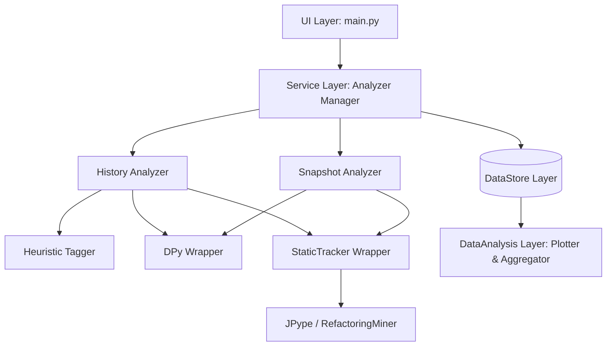

#ChronoCode

We will build a static analysis system to inspect python code smell trends (using DPy and StaticCodeTracker) for both snapshots (comparing the current code state with its parent revision) and historical commit progressions (categorizing smell introductions/removals by AI vs. Human authorship).

> [!IMPORTANT]
> **Work in Progress:** This is the version 0.1, not tested yet and further changes (both structural and implementative) are expected. The codebase will change a lot in the next few weeks.

> [!IMPORTANT]
> **Work in Progress:** This is the version 0.1, I am testing on a macbook Silicon. Therefore, use the following commands to create a proper virtual environment, enabling the launch through Rosetta for Python (needed for JPype, since RefactoringMiner is in Java. )

> ### 1. Force Python to run in x86_64 mode via Rosetta and create the venv
> arch -x86_64 python3 -m venv .venv_x86
> ### 2. Activate it (it will still run in x86_64 mode automatically)
> source .venv_x86/bin/activate
> ### 3. Install requirements
> arch -x86_64 python3 -m pip install -r requirements.txt


## Proposed Changes

ChronoCode is currently organized into 4 distinct layers:
1. **UI Layer**: Command Line Interface (`main.py`) and GUI (under `WebApp/server.py` and `WebApp/static/`, TODO...)
2. **Service Layer**: Analyzer scripts and classifiers (`Service/`)
3. **DataStore Layer**: Holds raw inputs, intermediate DPy outputs, matching outputs, and aggregated summary outputs (`DataStore/`)
4. **DataAnalysis Layer**: Aggregations, summaries, and plotting (`DataAnalysis/`)



### 1. UI Layer

####  [main.py](main.py)
A CLI entry point powered by `argparse` supporting:
- Command: `snapshot`
  - `--project-path`: Local path or remote git URL of python project.
  - `--dpy-path`: Path to DPy executable.
  - `--java-home`: Custom JAVA_HOME path.
- Command: `history`
  - `--project-path`: Local path or remote git URL.
  - `--dpy-path`: Path to DPy executable.
  - `--java-home`: Custom JAVA_HOME.
  - `--commits`: Limit number of commits to analyze (default: all).
  - `--since`: Filter commits starting from a commit hash or date.
- Command: `analyze-data`
  - `--data-dir`: Run aggregation/plotting on a saved analysis folder.

---

### 2. Service Layer

####  [heuristic_tagger.py](Service/Taggers/HeuristicTagger/heuristic_tagger.py)
Implements logic to determine if a commit is AI-generated vs. Human-authored:
- **Heuristics**:
  - `Co-authored-by:` fields in the commit message referencing `github-copilot`, `copilot`, `codex`, `claude`, `chatgpt`, `gpt`.
  - Message content heuristics (e.g., ends with `generated by Codex`, `generated by Copilot`, contains `copilot`, etc.).
  - Commits authored by bots (e.g. email containing `copilot`, `bot`).

####  [analyzer_manager.py](Service/ManagerService/analyzer_manager.py)
Orchestrates:
- Setting up the `DataStore` output folders using the `{project_name}_{hash}` format where `hash = md5(project_name + timestamp)`.
- Local cloning of the target project to protect the active directory.
- Restoring repository checkout states.
- Running DPy and StaticTracker sequentially.
- Formatting raw DPy outputs to match the schema expected by `DesignitePyCSVReader`.

####  [snapshot_analyzer.py](Service/SnapshotAnalyzer/snapshot_analyzer.py)
Workflow for a snapshot analysis:
1. Identify the current HEAD commit and its parent (HEAD~1).
2. Run DPy on the parent commit files (filtering for changed files in HEAD).
3. Run DPy on the child commit files (filtering for changed files in HEAD).
4. Run StaticTracker to find unmatched introduced smells.
5. Print results to console and output to `DataStore/`.

####  [history_analyzer.py](Service/HistoryAnalyzer/history_analyzer.py)
Workflow for history analysis:
1. Traverse the commit log.
2. For each commit (with at least one parent):
   - Check if any Python files were changed. If not, skip commit.
   - Tag the commit as `AI` or `Human`.
   - Run DPy on the parent state of the changed files.
   - Run DPy on the child state of the changed files.
   - Match smells using StaticTracker.
   - Record introduced (new) and removed (gone) smells, grouped by author (name, email) and tag (AI vs. Human).
3. Generate a combined execution summary.

---

### 3. DataStore & DataAnalysis Layers

####  [plotter.py](DataAnalysis/plotter.py)
Aggregates matching outputs from the `DataStore` run directory:
- Summarizes total smells introduced and removed by Author (Human vs AI).
- Plots trends over time (e.g., commit index vs. count of introduced/removed smells).
- Saves matplotlib/seaborn plots in `DataStore/{project_run}/plots/`.

---

## Verification Plan

### Automated / Semi-Automated CLI Verification
1. Create a dummy test git repository locally containing simple Python files, and make commits representing both Human edits and simulated AI commits (e.g. ending in `generated by Codex`).
2. Run the tool in `snapshot` mode:
   ```bash
   python3 main.py snapshot --project-path ./test_repo --dpy-path /path/to/working/DPy
   ```
3. Run the tool in `history` mode:
   ```bash
   python3 main.py history --project-path ./test_repo --dpy-path /path/to/working/DPy --commits 5
   ```
4. Verify that:
   - Output folder `DataStore/test_repo_[hash]/` contains raw smells, match results, and `summary.json`.
   - Summary accurately shows smell counts divided by AI vs Human.
   - Plot files are generated under `DataStore/test_repo_[hash]/plots/`.

---

## Phase 3: Web Application GUI & Data Plotting

We will build a Local Web GUI to allow users to interact with the analysis engine without the CLI, and visualize the results.

### Proposed Architecture

1. **Backend API (`WebApp/server.py`)**: 
   - A lightweight `FastAPI` server.
   - **Endpoints**:
     - `GET /api/runs`: List all completed analysis runs in the `DataStore`.
     - `GET /api/runs/{run_id}`: Fetch `manifest.json` and `summary.json` for a specific run.
     - `POST /api/analyze`: Trigger a new Snapshot or History analysis (runs `main.py` in a background thread or subprocess, streaming logs back via Server-Sent Events or WebSockets).
     - `GET /api/plots/{run_id}/{plot_name}`: Serve generated plot images.
2. **Frontend (`WebApp/static/`)**:
   - Modern, single-page application using **Vanilla HTML/JS/CSS**.
   - **Aesthetics**: Premium dark-mode interface with glassmorphism, subtle micro-animations, and a highly responsive layout to WOW the user.
   - **Features**:
     - **Dashboard**: View recent runs.
     - **Launcher**: A sleek form to configure and launch new analyses (Input project path, select Snapshot/History, select limits).
     - **Run Viewer**: Deep dive into a specific run, displaying the `plotter.py` charts and a data table of the introduced/removed smells.
3. **DataAnalysis (`DataAnalysis/plotter.py`)**:
   - Uses `matplotlib` and `seaborn` to generate beautiful PNG/SVG charts (e.g., Bar charts of AI vs Human smell introductions, Timeline of smells).
   - Called automatically at the end of a run by `history_analyzer.py` or triggered via the Web GUI.

## Acknowledgements

We would like to extend our gratitude to the following projects and communities that made ChronoCode possible:

### Core Dependencies
- **[DPy]()** - For comprehensive Python code smell detection and metrics analysis. DPy: Code Smells Detection Tool for Python." 2025 IEEE/ACM 22nd International Conference on Mining Software Repositories (MSR). IEEE, 2025

- **[StaticCodeTracker]()** - Li, Junjie, and Jinqiu Yang. "StaticTracker: A Diff Tool for Static Code Warnings." 2023 IEEE International Conference on Software Maintenance and Evolution (ICSME). IEEE, 2023.
- **[RefactoringMiner](https://github.com/tsantalis/RefactoringMiner)** - For detecting refactoring operations via JPype integration. 

### Backend & API
- **[FastAPI](https://fastapi.tiangolo.com/)** - Modern, fast web framework for building APIs
- **[Python](https://www.python.org/)** - The primary programming language

### Data Visualization & Analysis
- **[Matplotlib](https://matplotlib.org/)** - For generating high-quality plots and charts
- **[Seaborn](https://seaborn.pydata.org/)** - For statistical data visualization

### Frontend
- **[Vanilla HTML/CSS/JavaScript](https://developer.mozilla.org/)** - For clean, dependency-light frontend development

### Development Tools
- **[Git](https://git-scm.com/)** - Version control system
- **[JPype](https://jpype.readthedocs.io/)** - For Java-Python integration

### Community & Inspiration
- Thanks to all contributors and the open-source community for continuous feedback and support
- Special thanks to the static code analysis and code smell detection research communities

---

**Contributing**: We welcome contributions, bug reports, and feature requests. Please feel free to open an issue or submit a pull request.

**License**: See [LICENSE](LICENSE) file for details.


